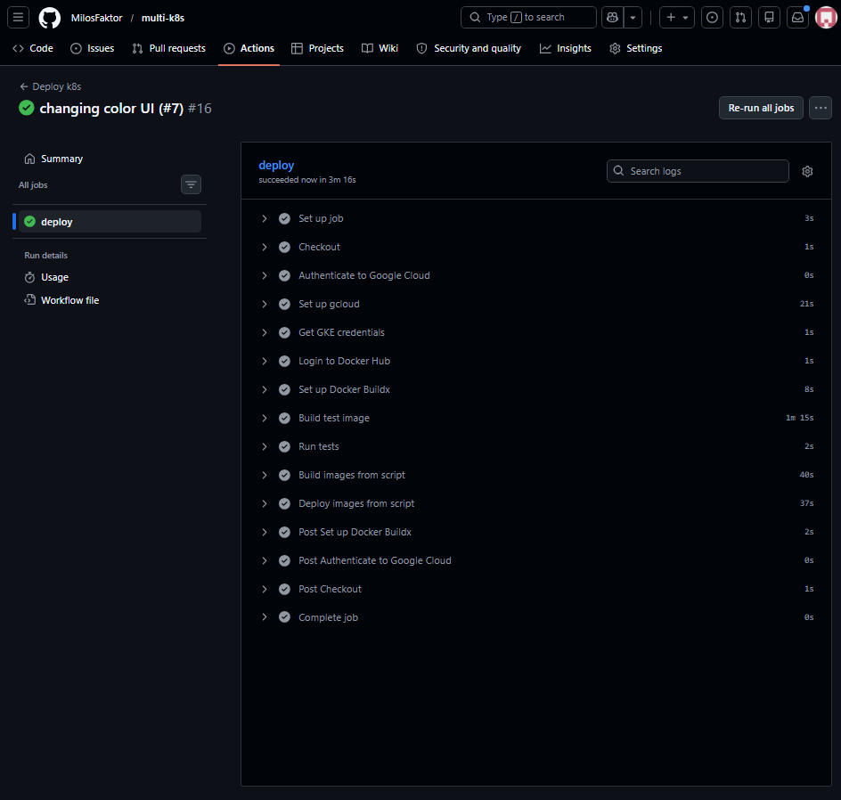
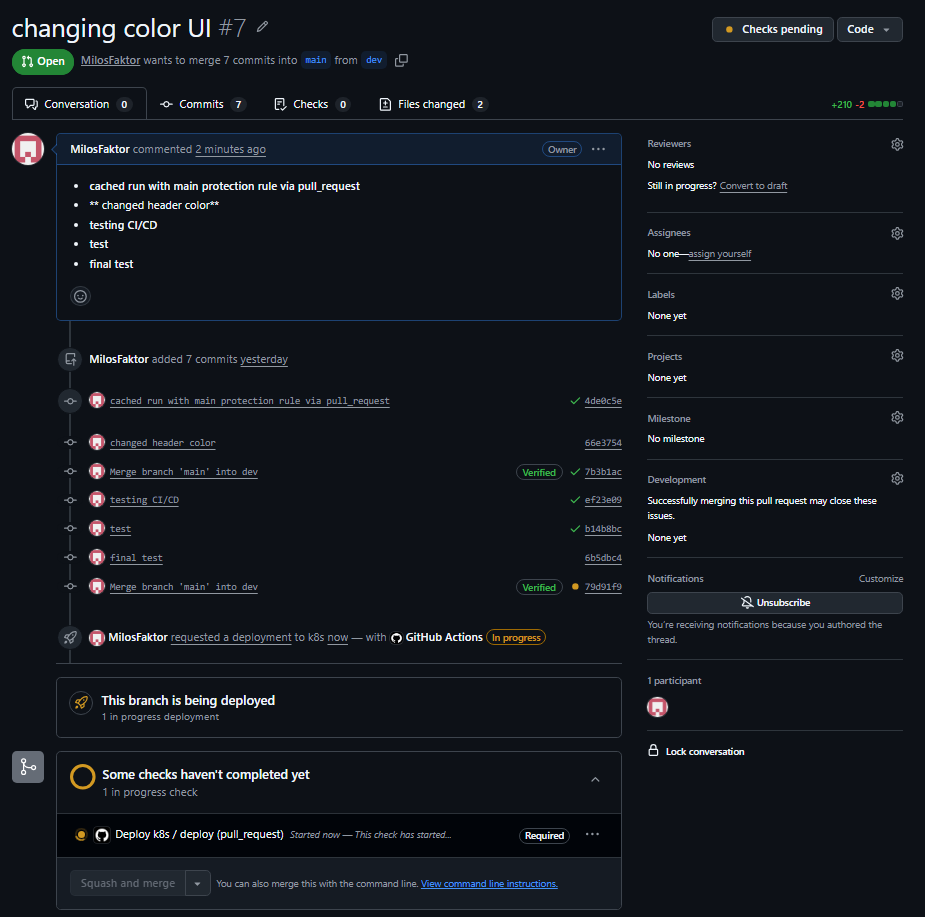
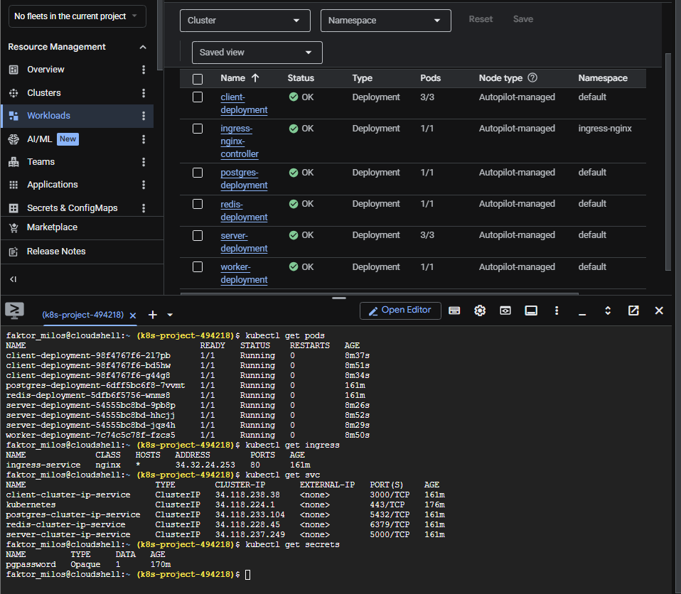
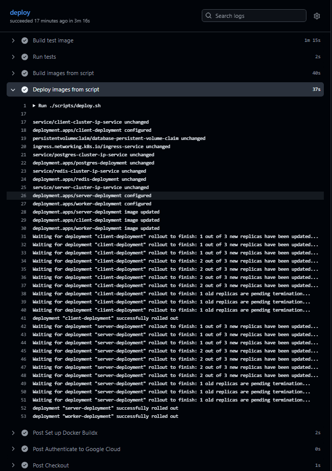
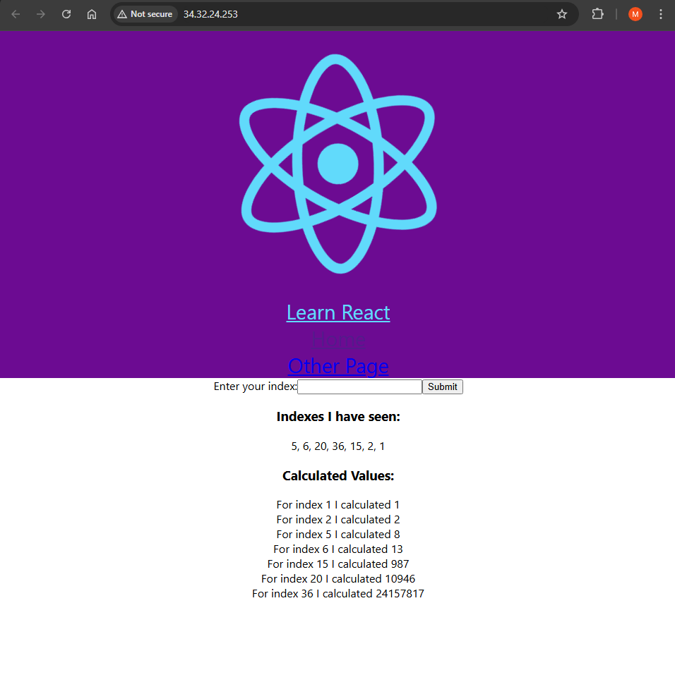
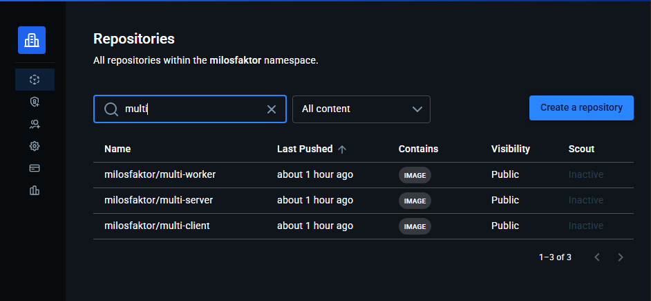
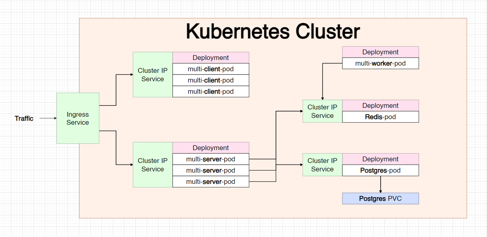

# 🚀 Distributed Kubernetes Application with CI/CD (Docker + GKE + GitHub Actions)

Production-style deployment of a distributed application using Kubernetes and CI/CD automation.

## 📌 Overview

Implemented and adapted a distributed Kubernetes application with a full CI/CD pipeline using GitHub Actions, including Docker image versioning, automated deployments, and cloud deployment on GKE.

This project demonstrates a multi-service system deployed on Kubernetes, covering the full workflow from local development to cloud deployment, including containerization, orchestration, and automated delivery.

The system is designed to showcase real-world cloud engineering practices and end-to-end system design.

This project was initially based on a reference architecture, but I implemented and adapted it independently, including replacing CI tooling, introducing Docker Buildx caching, and building a complete deployment pipeline to a managed Kubernetes cluster.

---

## 📷 Screenshots

### CI/CD Pipeline (GitHub Actions)

### Pull Request Validation (Tests Only)

### Kubernetes Workloads, Networking & Secrets

### Deployment Rollout

### Application Running

### Docker Images (Versioned with SHA)

### System Architecture

## 🧠 System Architecture

The application is built as a distributed system composed of multiple services:

- React frontend (client)
- Node.js API server (server)
- Worker service (background processing)
- Redis (in-memory data store)
- PostgreSQL (persistent database)

### Data Flow

1. User submits a number through the frontend
2. API server processes the request
3. Input is stored in PostgreSQL
4. A job is published to Redis
5. Worker consumes the job and computes the result
6. Result is stored in Redis
7. Frontend retrieves and displays computed values

This demonstrates asynchronous processing, service decoupling, and state separation.

---

## ☸️ Kubernetes Architecture

The system runs on Kubernetes using:

- Deployments for each service
- ClusterIP Services for internal communication
- Ingress for external access
- Persistent Volume Claim for PostgreSQL

Traffic is routed:

External Traffic → Ingress → Services → Pods

Each service runs independently and communicates through internal networking.

---

## 🔐 Configuration & Secrets

Application configuration is handled through environment variables shared across services.

Sensitive data is managed across two layers:

- GitHub Secrets → used in CI/CD for authentication (GCP, Docker Hub)
- Kubernetes Secrets → used at runtime inside the cluster (e.g., database credentials)

This approach separates build-time and runtime concerns and ensures that sensitive data is not exposed in the codebase.

---

## ⚙️ CI/CD Pipeline

The project uses GitHub Actions to automate testing, building, and deployment.

### Pull Request Workflow

- Builds test image
- Runs automated tests
- No deployment is performed

### Main Branch Workflow

- Authenticates to Google Cloud
- Builds Docker images for all services
- Uses commit-based versioning for traceability
- Pushes images to Docker Hub
- Deploys to Kubernetes cluster
- Performs rolling updates
- Verifies deployment status

The pipeline ensures controlled, repeatable deployments.

---

## 🐳 Containerization

Each service is containerized independently.

Images are versioned using:

- Latest tag (for reference)
- Commit-based tags (for precise deployments)

This allows reliable rollbacks and clear version tracking.

---

## 🔁 Local vs Cloud Environments

### Local Development

- Kubernetes cluster created using kind
- Manual build and deployment process
- Ingress configured for local testing
- Services tested through port-forwarding
- Tools such as Skaffold can be used to automate the local build and deployment loop

### Cloud Deployment (GKE)

- Managed Kubernetes cluster
- CI/CD pipeline handles all deployment steps
- Ingress controller installed via Helm
- External access managed through load balancing

This demonstrates understanding of both development and production environments.

---

## 📦 Project Structure

- client → frontend application
- server → API service
- worker → background processing
- k8s → Kubernetes manifests
- scripts → build and deployment automation
- .github/workflows → CI/CD pipeline

---

## 🚀 Key Features

- Distributed microservice architecture
- Kubernetes-based orchestration
- Automated CI/CD pipeline
- Rolling deployments with zero downtime
- Separation of build and deployment logic
- Support for local and cloud environments
- Secure secret management
- Docker layer caching optimization

---

## 🧠 Key Learnings

- Designing distributed systems with asynchronous processing
- Managing state across Redis and PostgreSQL
- Kubernetes networking and service discovery
- CI/CD pipeline design and automation
- Image versioning strategies
- Differences between local and production environments
- Infrastructure as a controlled system, not manual setup

---

## 🔒 HTTPS & Domain Considerations

This project focuses on system architecture, CI/CD automation, and Kubernetes deployment workflows.

HTTPS configuration and custom domain routing were intentionally not implemented, as the goal was to prioritize infrastructure, deployment, and service communication.

In a production environment, secure HTTPS access would be implemented using a managed load balancer with TLS certificates (e.g., ACM on AWS or managed certificates in GCP), along with DNS routing through a custom domain.

---

## ☁️ Cloud Context

I used GKE to understand managed Kubernetes environments. I primarily work with AWS, but I wanted to validate that I can transfer my knowledge across cloud providers.

---

## 🧑‍💻 Author

Cloud engineering project focused on real-world system design, deployment workflows, and automation.
